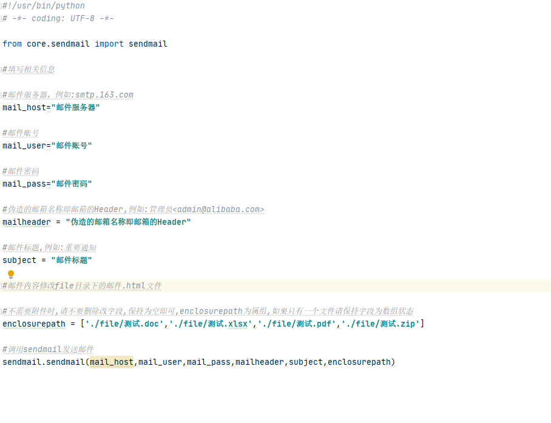
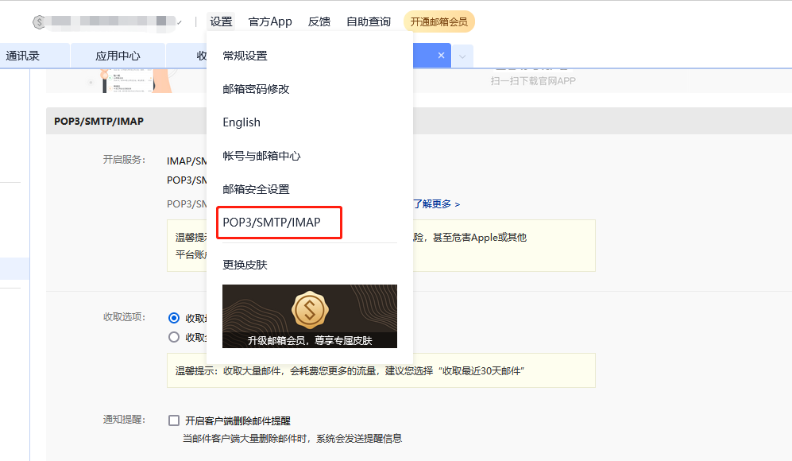
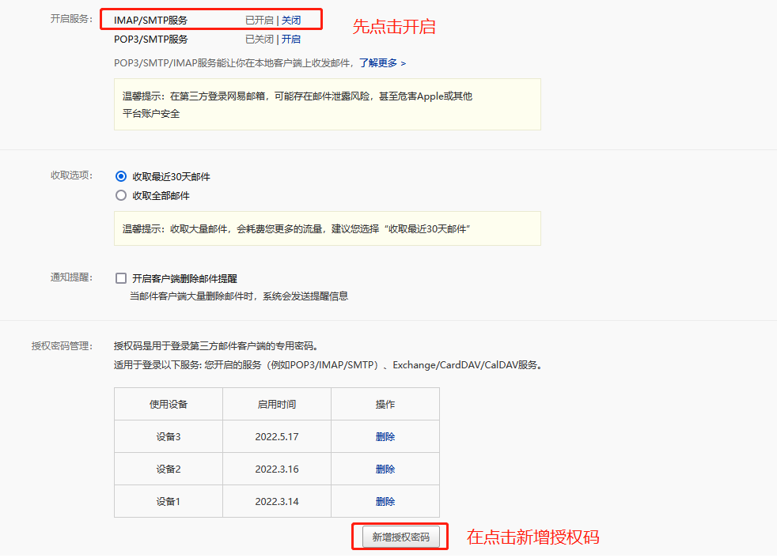
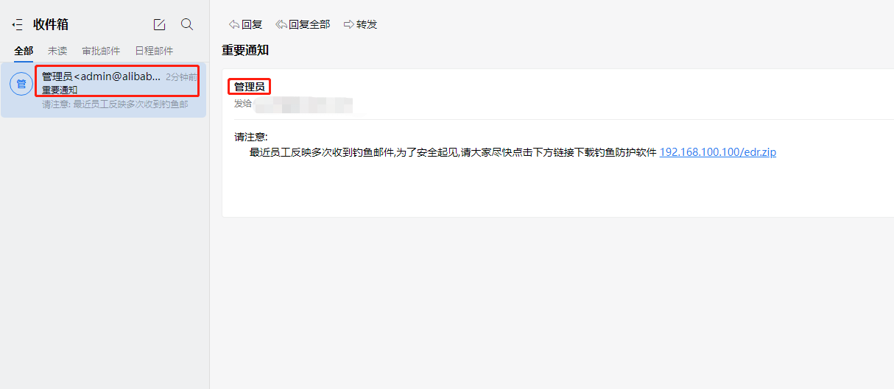
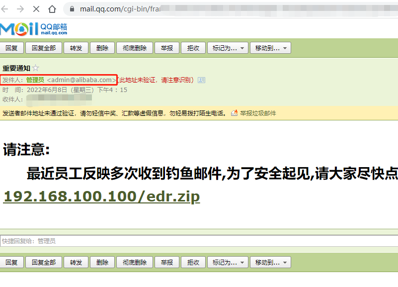
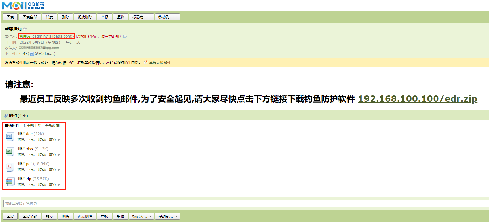

# Email_cheat_L
### 声明
此项目仅供学习交流，切勿进行非法操作，如产生的一切不良后果与作者无关。
### 项目主要功能:
  1.邮件伪造  
  2.批量邮件  
  3.携带附件发送
  
可以进行批量发送邮件进行钓鱼

### 文件结构如下:  
    
    core  
        --enclosure.py         //发送附件功能
        --mailhtml.py          //发送正文内容功能
        --sendmail.py          //邮件伪造核心功能
    file
        --邮箱账号.txt          //目标邮箱,不限量
        --邮件内容.html         //正文内容
     main.py
     
     邮件内容直接修改"邮件内容.html"的内容即可
     
### 如何运行  
在main.py中填写邮件服务器,邮箱账号,邮箱授权码,邮箱header(填写你要伪造的邮箱),邮箱标题,如果有附件,添加附件路径即可。  
  
#### 邮件授权码获取  
这里以163邮箱举例:  
  
  
### 启动
    
     执行命令:
        python3 main.py
  
   
### 效果  
企业邮箱:  

QQ邮箱:  
  
发送附件  

由于各企业邮箱显示不同,所以部分邮箱达不到邮件伪造的目的,自行测试。  
